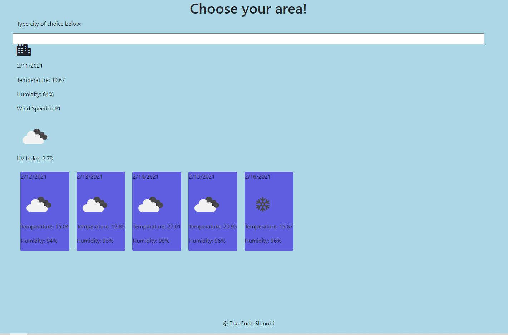

# 
Weather-Dashboard

The goal here is to use multiple API's (5 day forecast, UV, and Current day) to have a function weather app.
* [Github Repository] (https://github.com/malhill/Weather-Dashboard)
* [Weather App] (https://malhill.github.io/Weather-Dashboard/)

## HTML
* Creating a grid structure to seperate the list, weather cards, and weather data by divs. 
* Will need to practice the grid formatting and organizing the divs!

## CSS
* I experimented with the CSS here so that I could visually see the divs in different colors. It helped me seperate the five day forecast in a horizontal line. 

## JS
* Multiple AJAX
* Worked on creating and appending classes to the app
* I tried going with the idea of commenting on everything as if im talking to myself for clarity
* Went from nesting my ajax functions to seperating everything and calling the functions seperately. Must easier to understand/test.
* Again trying to understand different processes that I am referencing via google. Then taking the rules and applying them for myself. Good lookiing code means nothing without application. 

## Creators Note:
* Putting an AJAX within another AJAX was complex for my brain
* Definitely will work on this more
